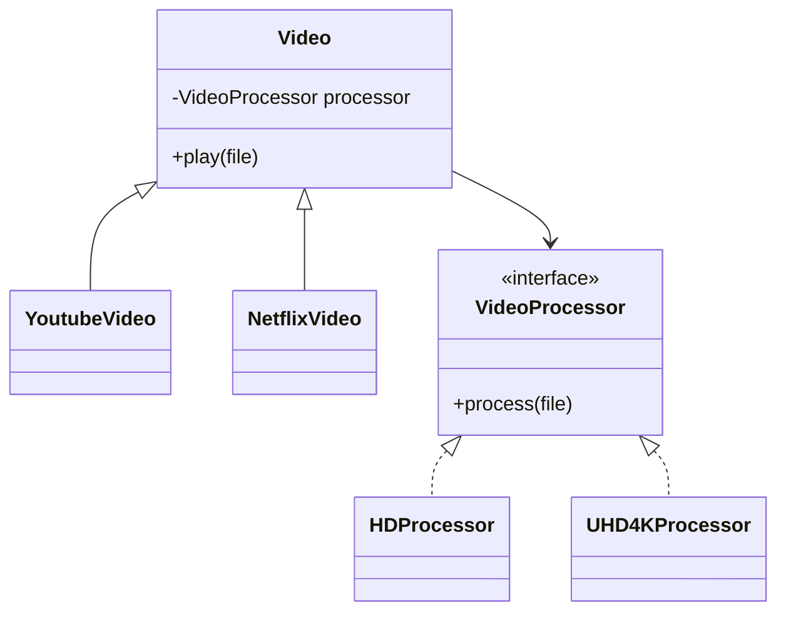

# Bridge Design Pattern

## Overview

The **Bridge Pattern** is a **structural design pattern** that separates **abstraction** from **implementation** by using **composition** instead of inheritance.

This helps in **reducing tight coupling** between classes and makes the system more **extensible**.

---

## Why Use Bridge Pattern?

- Avoid **exploding inheritance hierarchies**.
- Enable **independent extension** of abstraction and implementation.
- Promote **scalability** by separating concerns.

**Example Problem:**

Suppose you have a `Shape` class with `Rectangle` and `Triangle`.  
Each shape can have `Red` or `Yellow` color.

- Without bridge: You would need `RedRectangle`, `YellowRectangle`, `RedTriangle`, `YellowTriangle` → number of classes grows exponentially.

---

## Key Idea

- **Abstraction** → Main abstract class that the client interacts with.
- **Refined Abstraction** → Extends abstraction to add extra functionality.
- **Implementor** → Interface defining implementation operations.
- **Concrete Implementor** → Implements the interface and provides actual behavior.

👉 By **composition**, the abstraction holds a reference to the implementor, instead of inheriting it.

---

## Example Scenario

Imagine a **video streaming platform**:

- **Video providers**: YouTube, Netflix  
- **Video processors**: HD, 4K UHD  

**Without bridge:**

- You would need: `YoutubeHD`, `Youtube4K`, `NetflixHD`, `Netflix4K` → more classes with each new provider or processor.

**With bridge:**

- **Abstraction**: `Video` (holds a `VideoProcessor`)
- **Refined Abstraction**: `YoutubeVideo`, `NetflixVideo`
- **Implementor**: `VideoProcessor`
- **Concrete Implementor**: `HDProcessor`, `UHD4KProcessor`

This allows **independent extension** of video types and processor types.

---

## How It Works

1. **Abstraction** → `Video` class uses a `VideoProcessor`.  
2. **Refined Abstraction** → `YoutubeVideo`, `NetflixVideo` implement `play()`.  
3. **Implementor** → `VideoProcessor` interface defines `process(videoFile)`.  
4. **Concrete Implementor** → `HDProcessor`, `UHD4KProcessor` implement actual processing logic.  

---

## Benefits

- Reduces the number of subclasses.  
- Decouples abstraction from implementation.  
- Makes the system **easy to extend**.  
- Promotes **code reuse**.  

---

## Real-World Example (Java)

```java
Video youtubeVideo = new YoutubeVideo(new HDProcessor());
youtubeVideo.play("abc.mp4");

Video netflixVideo = new NetflixVideo(new UHD4KProcessor());
netflixVideo.play("abc.mp4");
```

- You can add a **new processor** like `HDRProcessor` without touching `Video` classes.  
- You can add a **new video provider** like `AmazonPrimeVideo` without touching processors.  

---

## Key Points for Freshers

- Focus on **composition over inheritance**.  
- Abstraction and implementation should vary independently.  
- Bridge pattern is **structural**, not about object creation.  
- Useful when **new dimensions** of variation appear frequently.  

---

## UML Diagram (Mermaid)



---

## References

- [HowToDoInJava: Bridge Pattern](https://howtodoinjava.com/design-patterns/structural/bridge-design-pattern/)  
- [Spring Framework Guru: Bridge Pattern](https://springframework.guru/gang-of-four-design-patterns/bridge-pattern/)  
- [Refactoring Guru: Bridge Pattern](https://refactoring.guru/design-patterns/bridge)  

